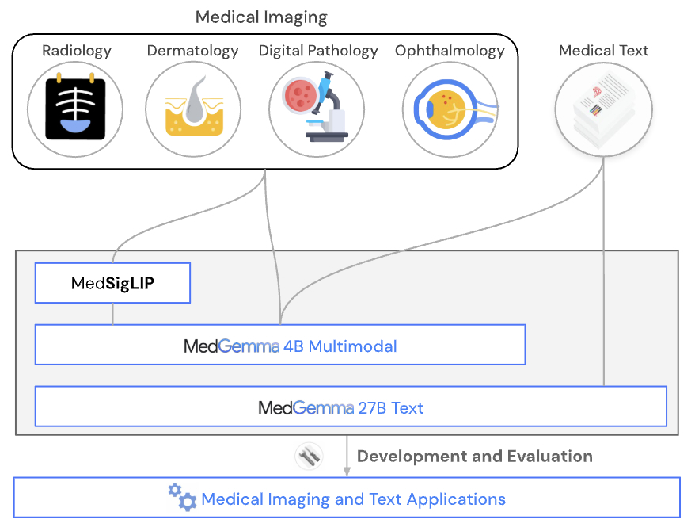

# MedGemma Vision Fine-Tuning

 

This model is a fine-tuned version of [unsloth/medgemma-4b-it-bnb-4bit](https://huggingface.co/unsloth/medgemma-4b-it-bnb-4bit).
It has been trained using [TRL](https://github.com/huggingface/trl).


Model documentation: [MedGemma](https://developers.google.com/health-ai-developer-foundations/medgemma)

Base model: [unsloth/medgemma-4b-it-bnb-4bit](https://huggingface.co/unsloth/medgemma-4b-it-bnb-4bit)

Model on HF hub: [yayamomt/medgemma-4b-it-bbbc006-nuclei-count-lora](https://huggingface.co/yayamomt/medgemma-4b-it-bbbc006-nuclei-count-lora)

`unsloth/medgemma-4b-it-bnb-4bit` fine-tuned with LoRA on BBBC006 to estimate the number of Hoechst-stained U2OS nuclei in fluorescence microscopy images.
MedGemma is a collection of Gemma 3 variants that are trained for performance on medical text and image comprehension.

 


The model takes an image and an instruction then returns JSON:

```json
{"nuclei_count": 87}
```

> **Research use only.** This is a proof-of-concept image-counting adapter, not a clinical, diagnostic, or production microscopy-analysis system.

## Reuse

This repository is a **LoRA adapter**, not a standalone model. Load
`unsloth/medgemma-4b-it-bnb-4bit` first, then attach this adapter with PEFT.
The published `README.md` includes a complete copyable inference example. Use
the exact training prompt and preprocess 16-bit TIFFs as during training:
per-image 1st--99.5th percentile scaling to 8-bit grayscale, followed by RGB
conversion. The expected output is JSON, for example `{"nuclei_count": 87}`.


## Training data

The labeled dataset was created from [BBBC006 v1](https://bbbc.broadinstitute.org/BBBC006), which contains Hoechst-stained U2OS microscopy images from 384 wells, with two fields of view per well. This adapter uses the `z=16`, `w1` (Hoechst/DAPI) TIFF images.

Targets are the BBBC006 `Image_Count_Nuclei` values. BBBC006 documents these as automated counts generated from the optimal-focus `z=16` plane using CellProfiler's `IdentifyPrimaryObjects`. These are automated reference counts, not independent manual annotations.

| Item | Value |
| --- | ---: |
| Total labeled images | 768 |
| Training images / wells | 614 / 307 |
| Evaluation images / wells | 154 / 77 |
| Split | Random, well-disjoint, seed 42 |

### Data processing

1. Match `z=16` TIFF files to BBBC006 count records using the stable well and site identifiers. The UUID suffixes differ between the image archive and count CSV.
2. Retain only `w1` Hoechst/DAPI images and exclude the `w2` phalloidin channel.
3. Scale each 16-bit grayscale TIFF independently using its 1st and 99.5th intensity percentiles, convert it to 8-bit grayscale, and then convert it to RGB.
4. Split the data by well using seed 42 and an 80/20 ratio. Both sites from each well remain in the same split.
5. Train the model to answer the fixed instruction with `{"nuclei_count": <integer>}`.

The training implementation is `scripts/fine_tune_medgemma_vision.py` in the source project.

## Training

This model was trained with SFT.

| Setting | Value |
| --- | --- |
| Base model | `unsloth/medgemma-4b-it-bnb-4bit` |
| Method | Supervised fine-tuning (LoRA) |
| LoRA rank / alpha / dropout | 16 / 16 / 0.05 |
| Adapted layers | Vision and language layers |
| Epochs | 5 |
| Learning rate | 2e-4, cosine schedule |
| Batch size / gradient accumulation | 1 / 4 |
| Maximum sequence length | 512 |
| Precision | BF16 where supported; 4-bit base-model loading |
| Hardware | One NVIDIA H100 GPU |

The run uses `load_best_model_at_end`, selecting epoch 4 by validation loss (`eval_loss=0.26`).

### Framework versions

- PEFT 0.20.0
- TRL: 0.24.0
- Transformers: 5.5.0
- Pytorch: 2.6.0+cu124
- Datasets: 4.3.0
- Tokenizers: 0.22.2


## Result

The final adapter and base model were evaluated on the same 154-image, 77-well held-out BBBC006 split. Both fields of view from a well are assigned to the same split. Both models used identical prompts, image preprocessing, and deterministic decoding.

| Metric | Base model | Fine-tuned | Improvement |
|---|---:|---:|---:|
| MAE | 26.62 | **4.22** | **84.1%** |
| RMSE | 36.47 | **5.46** | **85.0%** |
| MAPE | 40.25% | **14.65%** | **63.6%** |
| Median absolute error | 19 | **4** | **78.9%** |
| Mean error (bias) | -6.90 | **-1.65** | **76.0%** |
| R² | 0.14 | **0.98** | **+0.84** |
| Within ±5 nuclei | 28/154 (18.2%) | **107/154 (69.5%)** | **+51.3** |
| Within ±10 nuclei | 46/154 (29.9%) | **149/154 (96.8%)** | **+66.9** |

The training-reference-mean baseline predicts 106.4967 nuclei for every image and has MAE 29.90 and RMSE 40.07 on the same split. The fine-tuned model's mean prediction is 97.25 versus a mean reference count of 98.91. This comparison shows that the adapter learned image-dependent counting within BBBC006; it is not an external benchmark comparison.

## Evaluation output

The standalone evaluator generates `full_eval_predictions.json` in the adapter output directory. It includes:

- aggregate MAE, RMSE, MAPE, and valid-output count;
- every held-out image path and reference count;
- the raw model response;
- the parsed `predicted_nuclei_count`.

The complete 154-image results are at [full_eval_predictions.json](data/full_eval_predictions.json). The separate [eval_predictions.json](data/eval_predictions.json) file contains only the deterministic 10-image post-training spot check.

##  Use case

Use this adapter for research experiments that investigate whether a vision-language model can estimate BBBC006 automated nucleus counts from optimal-focus z=16 Hoechst images. Outputs should be parsed as JSON and reviewed alongside the image.

It is not intended for cell segmentation, instance-level nucleus localization, clinical microscopy, general cell counting, or measurements without quality control.

## Quick start: reproduce training and evaluation

### 1. Clone the repository

```bash
git clone https://github.com/yahyamomtaz/medgemma-vision-fine-tuning.git
cd medgemma-vision-fine-tuning
```

### 2. Create an environment and install the requirements

Python 3.11 or 3.12 is recommended.

```bash
python3.11 -m venv .venv
source .venv/bin/activate
python -m pip install --upgrade pip
python -m pip install torch torchvision torchaudio \
  --index-url https://download.pytorch.org/whl/cu121
python -m pip install -r requirements.txt
```

Accept the applicable MedGemma terms and authenticate with Hugging Face before
downloading the gated base model:

```bash
hf auth login
```

### 3. Download the BBBC006 files

This counting experiment needs only the optimal-focus `z=16` image archive and
the counts CSV. It does **not** require all 34 z-plane archives or
`BBBC006_v1_labels.zip`;

```bash
mkdir -p data
curl -L \
  https://data.broadinstitute.org/bbbc/BBBC006/BBBC006_v1_images_z_16.zip \
  -o data/BBBC006_v1_images_z_16.zip
unzip data/BBBC006_v1_images_z_16.zip -d data
curl -L \
  https://data.broadinstitute.org/bbbc/BBBC006/BBBC006_v1_counts.csv \
  -o data/BBBC006_v1_counts.csv
```

The expected layout is:

```text
data/
├── BBBC006_v1_counts.csv
└── BBBC006_v1_images_z_16/
    └── *.tif
```

The image archive contains both `w1` and `w2` channels. The training script
automatically selects the 768 `w1` Hoechst/DAPI images and matches them to the
CSV by well and site; the UUID portions of the filenames are not expected to
match.

### 4. Validate the data and create the split

Run a dry run first. It performs file matching and creates the deterministic
well-disjoint manifests without loading or training the model.

```bash
python fine_tune_medgemma_vision.py \
  --images_dir data/BBBC006_v1_images_z_16 \
  --counts_file data/BBBC006_v1_counts.csv \
  --manifest_dir data/bbbc006_z16_vision \
  --dry_run
```

Check that it reports 768 matched `w1` images, with 614 training images from
307 wells and 154 evaluation images from 77 wells.

### 5. Fine-tune the LoRA adapter

```bash
python -u fine_tune_medgemma_vision.py \
  --model_name unsloth/medgemma-4b-it-bnb-4bit \
  --images_dir data/BBBC006_v1_images_z_16 \
  --counts_file data/BBBC006_v1_counts.csv \
  --manifest_dir data/bbbc006_z16_vision \
  --output_dir models/medgemma-4b-it-sft-lora-bbbc006-z16 \
  --epochs 5 \
  --prediction_samples 10
```

This saves the adapter under
`models/medgemma-4b-it-sft-lora-bbbc006-z16/` and prints predictions for 10
held-out images at the end of training.

### 6. Evaluate all images

Evaluate the fine-tuned adapter on the complete 154-image evaluation manifest:

```bash
python -u evaluation.py \
  --model_name_or_path models/medgemma-4b-it-sft-lora-bbbc006-z16 \
  --eval_file data/bbbc006_z16_vision/eval.jsonl \
  --train_file data/bbbc006_z16_vision/train.jsonl \
  --output_file models/medgemma-4b-it-sft-lora-bbbc006-z16/full_eval_predictions.json
```

For a baseline comparison, run the same evaluator on the same
manifest with the base model:

```bash
mkdir -p results
python -u evaluation.py \
  --model_name_or_path unsloth/medgemma-4b-it-bnb-4bit \
  --eval_file data/bbbc006_z16_vision/eval.jsonl \
  --train_file data/bbbc006_z16_vision/train.jsonl \
  --output_file results/medgemma_base_bbbc006_z16_full_eval_predictions.json
```

## Use the fine-tuned model

The adapter can be loaded directly from Hugging Face or from the local output
directory created during training. Because this is a LoRA adapter,
`FastVisionModel.from_pretrained` also loads its declared base model,
`unsloth/medgemma-4b-it-bnb-4bit`.

Use the
[inference.py](https://github.com/yahyamomtaz/medgemma-vision-fine-tuning/blob/main/inference.py)
script with a `z=16`, `w1` Hoechst/DAPI TIFF. By default it downloads and uses
the published Hugging Face adapter:

```bash
python inference.py \
  data/BBBC006_v1_images_z_16/mcf-z-stacks-03212011_a01_s1_w1248254b0-0193-4e11-8762-62b5d2b86216.tif
```

The result would be:

```json
{
  "image_path": "data/BBBC006_v1_images_z_16/mcf-z-stacks-03212011_a01_s1_w1248254b0-0193-4e11-8762-62b5d2b86216.tif",
  "raw_response": "{\"nuclei_count\":87}",
  "predicted_nuclei_count": 87
}
```


## License and attribution

The adapter is a derivative of MedGemma and is subject to the applicable [Health AI Developer Foundations terms](https://huggingface.co/google/medgemma-4b-it). Cite BBBC006 when using its images or labels, and verify all applicable terms before redistribution.

## Citation

The model has been trained using TRL.

If you use this adapter, cite BBBC006.

```bibtex
@misc{vonwerra2022trl,
	title        = {{TRL: Transformer Reinforcement Learning}},
	author       = {Leandro von Werra and Younes Belkada and Lewis Tunstall and Edward Beeching and Tristan Thrush and Nathan Lambert and Shengyi Huang and Kashif Rasul and Quentin Gallou{\'e}dec},
	year         = 2020,
	journal      = {GitHub repository},
	publisher    = {GitHub},
	howpublished = {\url{https://github.com/huggingface/trl}}
}
```

```bibtex
@article{ljosa2012annotated,
  title={Annotated high-throughput microscopy image sets for validation},
  author={Ljosa, Vebjorn and others},
  journal={Nature Methods},
  year={2012}
}
```

---
base_model: unsloth/medgemma-4b-it-bnb-4bit
library_name: peft
model_name: medgemma-4b-it-sft-lora-bbbc006-z16
tags:
- base_model:adapter:unsloth/medgemma-4b-it-bnb-4bit
- lora
- sft
- transformers
- trl
- unsloth
license: other
license_name: health-ai-developer-foundations
license_link: https://developers.google.com/health-ai-developer-foundations/terms
pipeline_tag: image-text-to-text
---
